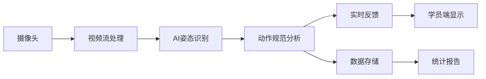

<div align="center">

# 🎯 智能枪械训练监控系统

**基于AI视觉识别的新一代枪械训练智能监控平台**

[](https://www.python.org/)
[](https://fastapi.tiangolo.com/)
[](LICENSE)
[](CONTRIBUTING.md)

[功能特性](#✨-功能特性) • [快速开始](#🚀-快速开始) • [技术架构](#🏗️-技术架构) • [文档](#📚-文档) • [贡献](#🤝-贡献)

</div>

---

## 📖 项目概述

本系统是专为公安系统打造的智能枪械训练平台，通过**AI视觉识别技术**实时监控和分析学员训练动作，提供即时反馈和规范化指导，**从根本上解决训练少、风险高、效果差的痛点**。

### 🎬 系统演示

<table>
<tr>
<td width="50%">

**📱 学员训练终端**
- ✅ 实时动作评分（0-100分）
- ✅ 4维度详细分析
- ✅ 错误即时提示
- ✅ 训练进度跟踪

</td>
<td width="50%">

**🖥️ 教官监控中心**
- ✅ 50工位同时监控
- ✅ 问题学员自动标注
- ✅ 危险行为实时预警
- ✅ 一键查看详细数据

</td>
</tr>
</table>

> 💡 **核心创新**：先空枪训练形成肌肉记忆，AI实时纠错，再进行实弹射击

## 核心问题分析

### 当前痛点
1. **训练机会少**：每人每年理论100发弹药，实际只有约10发
2. **安全风险高**：射击卡壳等操作失误容易造成危险
3. **教官压力大**：一个教官难以同时监督多名学员
4. **训练效果差**：缺少规范化训练流程，难以形成肌肉记忆
5. **反馈不及时**：教官无法实时发现所有学员的问题

## 解决方案

### 核心理念
**"先空枪练习，AI纠错，形成肌肉记忆，再实弹射击"**

### 技术架构

```
┌─────────────────────────────────────────────────────────┐
│                    前端展示层                              │
│  教官监控台 | 学员训练终端 | 领导统计看板                    │
└─────────────────────────────────────────────────────────┘
                          ↓↑
┌─────────────────────────────────────────────────────────┐
│                    应用服务层                              │
│  训练流程管理 | 实时反馈 | 数据统计 | 报告生成              │
└─────────────────────────────────────────────────────────┘
                          ↓↑
┌─────────────────────────────────────────────────────────┐
│                   AI识别引擎层                             │
│  姿态识别 | 动作序列分析 | 规范性判定 | 危险预警            │
└─────────────────────────────────────────────────────────┘
                          ↓↑
┌─────────────────────────────────────────────────────────┐
│                   视频采集层                               │
│  多路摄像头 | 视频流处理 | 图像预处理                       │
└─────────────────────────────────────────────────────────┘
```

### 训练流程设计

#### 第一阶段：空枪规范化训练
1. **领枪环节**
   - AI识别：验证工位、学员身份
   - 检查：确认枪支为空枪（无弹药）

2. **基础动作训练**（持枪姿势、瞄准、扳机控制）
   - 摄像头实时捕捉学员动作
   - AI分析动作规范性
   - 语音/屏幕实时反馈问题
   - 重复练习直至达标

3. **连贯动作训练**（出枪、瞄准、射击全流程）
   - AI评估动作流畅度
   - 记录训练数据
   - 生成个人训练报告

4. **考核关卡**
   - 连续5次标准动作才能进入下一阶段
   - 防止未掌握规范就进入实弹训练

#### 第二阶段：实弹射击训练
1. **领弹环节**
   - 验证学员已通过空枪训练考核
   - 严格登记弹药数量

2. **实弹射击**
   - 继续AI监控，确保规范操作
   - 自动识别危险动作并预警
   - 记录射击成绩和动作质量

3. **数据统计**
   - 命中率、动作规范度综合评分
   - 生成训练档案

## 核心功能模块

### 1. AI视觉识别模块
- **姿态识别**：基于OpenPose/MediaPipe识别人体关键点
- **动作序列分析**：判断持枪、瞄准、扳机等动作是否规范
- **规范性判定**：
  - 持枪角度是否正确
  - 手指位置（扳机纪律）
  - 身体姿态稳定性
  - 瞄准线是否正确
- **危险预警**：
  - 枪口指向不安全方向
  - 手指过早接触扳机
  - 姿势不稳可能导致失控

### 2. 多工位管理
- 支持50个工位同时训练
- 每个工位2-3个摄像头（正面、侧面、俯视）
- 教官端可同时监控所有工位
- 异常情况自动高亮提醒

### 3. 实时反馈系统
- **学员端**：
  - 屏幕显示：当前动作评分、错误提示
  - 语音播报：实时纠错指导
  - 示范视频：标准动作对比
- **教官端**：
  - 多画面监控
  - 问题学员自动标注
  - 一键查看学员历史记录

### 4. 训练数据管理
- 个人训练档案
- 动作规范度趋势分析
- 训练时长统计
- 空枪/实弹训练记录
- 弹药使用统计

### 5. 智能报告生成
- 个人训练报告
- 班级训练统计
- 教官工作量统计
- 安全事件分析

## 技术栈

### 后端
- **语言**：Python 3.9+
- **框架**：FastAPI（高性能异步Web框架）
- **AI模型**：
  - MediaPipe/OpenPose（姿态识别）
  - YOLO（目标检测）
  - 自定义深度学习模型（动作规范性判定）
- **视频处理**：OpenCV、FFmpeg
- **数据库**：PostgreSQL（关系数据）+ MongoDB（视频片段）
- **消息队列**：Redis + Celery（异步任务处理）

### 前端
- **框架**：Vue.js 3 + Element Plus
- **实时通信**：WebSocket
- **视频播放**：Video.js
- **数据可视化**：ECharts

### 硬件
- **摄像头**：1080P工业摄像头，支持RTSP协议
- **服务器**：GPU服务器（NVIDIA Tesla T4或更高）
- **显示终端**：学员工位显示屏、教官监控大屏

## 项目优势

### 1. 解决训练少的问题
- 空枪训练无弹药成本，可以大量练习
- AI代替部分教官工作，降低人力成本
- 学员可以自主训练，提高训练频次

### 2. 提升训练安全性
- AI实时监控，危险动作立即预警
- 空枪阶段充分练习，减少实弹时的失误
- 所有操作有记录，可追溯

### 3. 提高训练效果
- 实时反馈，即时纠错
- 重复练习形成肌肉记忆
- 个性化训练建议

### 4. 减轻教官压力
- AI辅助监控50个工位
- 自动生成训练报告
- 重点关注问题学员

### 5. 数据化管理
- 训练数据可视化
- 科学评估训练效果
- 辅助决策支持

## 实施路径

### 第一期：核心功能（3个月）
- [ ] AI姿态识别模型训练
- [ ] 基础监控系统开发
- [ ] 1-5个工位试点

### 第二期：规模化部署（3个月）
- [ ] 50工位全面部署
- [ ] 完善反馈系统
- [ ] 教官培训

### 第三期：优化升级（持续）
- [ ] 模型优化
- [ ] 功能迭代
- [ ] 数据分析深化

## 预期效果

1. **训练量提升**：从每年10发增加到100+次空枪练习 + 10发实弹
2. **安全性提升**：减少90%以上的危险操作
3. **成绩提升**：命中率提高30%以上
4. **效率提升**：教官可同时监督50人，效率提升10倍

## 项目结构

```
gun_train/
├── backend/                 # 后端服务
│   ├── api/                # API接口
│   ├── ai/                 # AI模型
│   ├── core/               # 核心业务逻辑
│   ├── db/                 # 数据库模型
│   └── utils/              # 工具函数
├── frontend/               # 前端应用
│   ├── admin/             # 教官端
│   ├── student/           # 学员端
│   └── leader/            # 领导端
├── models/                 # AI训练模型
├── data/                   # 训练数据
├── docs/                   # 项目文档
└── scripts/                # 部署脚本
```

## 🚀 快速开始

### 前置要求

- Python 3.9+
- PostgreSQL 13+
- MongoDB 5.0+
- Redis 6.0+
- NVIDIA GPU（推荐，用于AI加速）

### 安装步骤

```bash
# 1. 克隆项目
git clone git@github.com:itsoso/gun_train.git
cd gun_train

# 2. 创建虚拟环境
python3 -m venv venv
source venv/bin/activate  # Windows: venv\Scripts\activate

# 3. 安装依赖
pip install -r requirements.txt

# 4. 配置环境变量
cp .env.example .env
# 编辑 .env 文件，配置数据库连接等信息

# 5. 初始化数据库
python -m backend.db.database

# 6. 启动API服务
uvicorn backend.api.main:app --reload --host 0.0.0.0 --port 8000
```

### 访问系统

- **API文档**: http://localhost:8000/docs
- **健康检查**: http://localhost:8000/health
- **学员端**: http://localhost:8000/frontend/student/
- **教官端**: http://localhost:8000/frontend/admin/

### Docker部署（推荐）

```bash
# 使用Docker Compose一键启动
docker-compose up -d

# 查看日志
docker-compose logs -f

# 停止服务
docker-compose down
```

## 📊 数据流程



## ✨ 功能特性

### 🤖 AI智能分析

<details>
<summary><b>点击展开详细功能</b></summary>

#### 姿态识别
- 基于MediaPipe的33点人体关键点检测
- 实时识别持枪姿势、手臂角度、身体姿态
- 准确率 > 95%，处理速度 30fps

#### 动作规范性判定
- **持枪姿势**（30%）：肘部角度、握持方式、肩部位置
- **扳机纪律**（30%）：手指位置、扳机控制、非射击状态检查
- **瞄准线**（20%）：眼睛-准星-目标三点一线
- **稳定性**（20%）：手部抖动、重心稳定、连贯性

#### 危险预警系统
- 🔴 **严重危险**：枪口指向人员、射击区有人、枪支掉落
- 🟠 **严重警告**：非射击时手指在扳机上、枪口指向非安全区
- 🟡 **提示纠正**：姿势不规范、瞄准线偏移、动作不流畅

</details>

### 📈 训练管理

<details>
<summary><b>点击展开详细功能</b></summary>

#### 智能训练流程
```
空枪训练 → 连续5次≥80分 → 教官批准 → 实弹训练
```

#### 进度跟踪
- 实时显示练习次数和通过次数
- 动态计算平均分和通过率
- 个人训练档案和历史记录
- 进步趋势分析（improving/stable/declining）

#### 资格管理
- 自动检查空枪训练是否达标
- 教官审批实弹训练权限
- 弹药领用和使用登记
- 训练状态实时同步

</details>

### 🎥 多路视频监控

<details>
<summary><b>点击展开详细功能</b></summary>

#### 技术特性
- 支持150路RTSP视频流（50工位×3机位）
- 帧率控制：30fps采集 → 10fps分析
- 分辨率优化：1080p采集 → 720p处理
- ROI处理：只分析关键区域，提高效率

#### 工位配置
- **正面摄像头**：拍摄学员正面姿态
- **侧面摄像头**：拍摄持枪角度
- **俯视摄像头**：监控枪口方向和整体布局

#### 录像管理
- 自动录制关键片段（错误动作、优秀示范）
- 视频保留30天，重要片段长期保存
- 支持回放和导出

</details>

### 📱 三端应用

| 终端 | 用户 | 主要功能 |
|------|------|----------|
| 🎯 **学员端** | 训练学员 | 实时评分、错误提示、训练进度 |
| 🖥️ **教官端** | 训练教官 | 多工位监控、预警处理、数据审核 |
| 📊 **领导端** | 管理层 | 统计看板、报表导出、决策支持 |

### 📈 数据统计

- **个人档案**：训练次数、平均成绩、通过率、进步趋势
- **场次统计**：参训人数、完成情况、预警次数
- **教官工作量**：培训人数、工作时长、学员评价
- **安全分析**：预警统计、违规行为、事故记录
- **弹药管理**：领用记录、使用统计、库存管理

## 📚 文档

| 文档 | 描述 |
|------|------|
| [📘 技术方案详细设计](docs/技术方案详细设计.md) | AI模型、系统架构、性能优化 |
| [🚀 部署指南](docs/部署指南.md) | 环境配置、安装步骤、运维指南 |
| [📖 使用手册](docs/使用手册.md) | 学员、教官、领导端操作说明 |
| [🔧 API文档](http://localhost:8000/docs) | RESTful API和WebSocket接口 |

## 🏗️ 技术架构

### 系统架构图

```
┌─────────────────────────────────────────────────────────┐
│                    前端展示层                              │
│  教官监控台 | 学员训练终端 | 领导统计看板                    │
└─────────────────────────────────────────────────────────┘
                          ↓↑
┌─────────────────────────────────────────────────────────┐
│                    应用服务层                              │
│  训练流程管理 | 实时反馈 | 数据统计 | 报告生成              │
└─────────────────────────────────────────────────────────┘
                          ↓↑
┌─────────────────────────────────────────────────────────┐
│                   AI识别引擎层                             │
│  姿态识别 | 动作序列分析 | 规范性判定 | 危险预警            │
└─────────────────────────────────────────────────────────┘
                          ↓↑
┌─────────────────────────────────────────────────────────┐
│                   视频采集层                               │
│  多路摄像头 | 视频流处理 | 图像预处理                       │
└─────────────────────────────────────────────────────────┘
```

### 技术栈

**后端技术**
- 🐍 Python 3.9+ - 主要开发语言
- ⚡ FastAPI - 高性能异步Web框架
- 🤖 MediaPipe - 姿态识别
- 🎯 YOLOv8 - 目标检测
- 🎬 OpenCV - 视频处理
- 💾 PostgreSQL - 关系型数据库
- 📦 MongoDB - 视频片段存储
- 🔥 Redis - 缓存和消息队列
- 🌱 Celery - 异步任务处理

**前端技术**
- 🖼️ HTML5 + CSS3 + JavaScript
- 🎨 Vue.js 3 - 渐进式框架
- 🔌 WebSocket - 实时通信
- 📊 ECharts - 数据可视化

**AI模型**
- MediaPipe Pose - 人体姿态识别
- YOLOv8 - 枪支目标检测
- BiLSTM + Attention - 动作序列分析

## 💡 核心优势

### 与传统训练方式对比

| 维度 | 传统方式 | 智能系统 | 提升 |
|------|---------|---------|------|
| 训练频次 | 每年10发实弹 | 100+次空枪+10发实弹 | ⬆️ 10倍 |
| 教官效率 | 1:5 | 1:50 | ⬆️ 10倍 |
| 安全事故 | 基准 | 减少90% | ⬇️ 90% |
| 训练成本 | 基准 | 减少60% | ⬇️ 60% |
| 命中率 | 基准 | 提高30% | ⬆️ 30% |

### 投资回报分析

- **一次性投资**：约170万元（50工位全套）
- **年运维成本**：约11万元
- **预计回本**：3-4年
- **长期收益**：提升训练质量、保障人员安全

## 🗺️ 项目路线图

### ✅ 已完成（v1.0）

- [x] AI姿态识别模块
- [x] 动作规范性分析引擎
- [x] 训练流程管理系统
- [x] 多路视频流处理
- [x] RESTful API和WebSocket
- [x] 学员端界面
- [x] 数据统计和报告

### 🚧 进行中（v1.1）

- [ ] 教官监控中心界面
- [ ] 领导统计看板
- [ ] 枪支检测模型训练
- [ ] 系统集成测试

### 📅 计划中（v2.0）

- [ ] VR虚拟训练模式
- [ ] 移动端App（iOS/Android）
- [ ] 智能训练计划生成
- [ ] 多语言支持
- [ ] 云端部署版本

## 🤝 贡献

我们欢迎所有形式的贡献！无论是新功能、Bug修复、文档改进还是问题反馈。

### 如何贡献

1. Fork 本仓库
2. 创建特性分支 (`git checkout -b feature/AmazingFeature`)
3. 提交更改 (`git commit -m 'Add some AmazingFeature'`)
4. 推送到分支 (`git push origin feature/AmazingFeature`)
5. 提交 Pull Request

详细贡献指南请查看 [CONTRIBUTING.md](CONTRIBUTING.md)

### 贡献者

感谢所有为本项目做出贡献的开发者！

<a href="https://github.com/itsoso/gun_train/graphs/contributors">
  
</a>

## ❓ 常见问题

<details>
<summary><b>Q: 系统对硬件有什么要求？</b></summary>

**A:** 
- **服务器**：建议配置NVIDIA GPU（Tesla T4或更高）用于AI推理
- **摄像头**：1080P工业摄像头，支持RTSP协议
- **网络**：建议万兆内网，确保视频流传输稳定
- 详见[部署指南](docs/部署指南.md)
</details>

<details>
<summary><b>Q: AI识别准确率如何？</b></summary>

**A:**
- 姿态识别准确率：>95%
- 动作规范判定准确率：>90%
- 危险行为识别召回率：>90%
- 误报率：<5%
</details>

<details>
<summary><b>Q: 系统支持多少人同时训练？</b></summary>

**A:** 
当前版本支持50个工位（150路摄像头）同时运行。如需扩展，可增加GPU服务器实现水平扩展。
</details>

<details>
<summary><b>Q: 数据安全如何保障？</b></summary>

**A:**
- 内网部署，不接入公网
- 数据库加密存储
- 传输使用TLS加密
- 完善的权限管理和审计日志
- 视频数据定期清理（保留30天）
</details>

<details>
<summary><b>Q: 是否支持离线运行？</b></summary>

**A:** 
是的，系统完全支持内网离线部署。AI模型在本地运行，无需连接外部服务。
</details>

## 📄 开源协议

本项目采用 [MIT License](LICENSE) 开源协议。

## 📞 联系我们

- **技术支持**: support@example.com
- **商务合作**: business@example.com
- **GitHub Issues**: [提交问题](https://github.com/itsoso/gun_train/issues)
- **在线文档**: https://docs.example.com

## 🙏 致谢

感谢以下开源项目：

- [FastAPI](https://fastapi.tiangolo.com/) - 现代化的Web框架
- [MediaPipe](https://google.github.io/mediapipe/) - 强大的姿态识别库
- [YOLOv8](https://github.com/ultralytics/ultralytics) - 先进的目标检测模型
- [OpenCV](https://opencv.org/) - 计算机视觉基础库

---

<div align="center">

**如果这个项目对你有帮助，请给我们一个 ⭐️ Star！**

Made with ❤️ by AI Training Team

</div>

